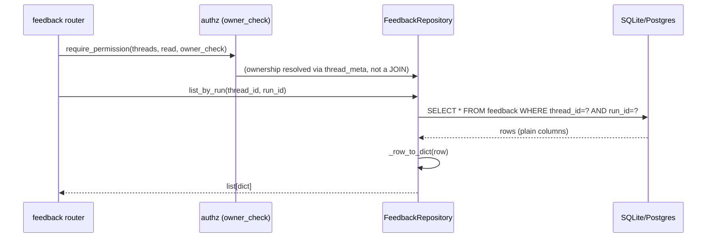
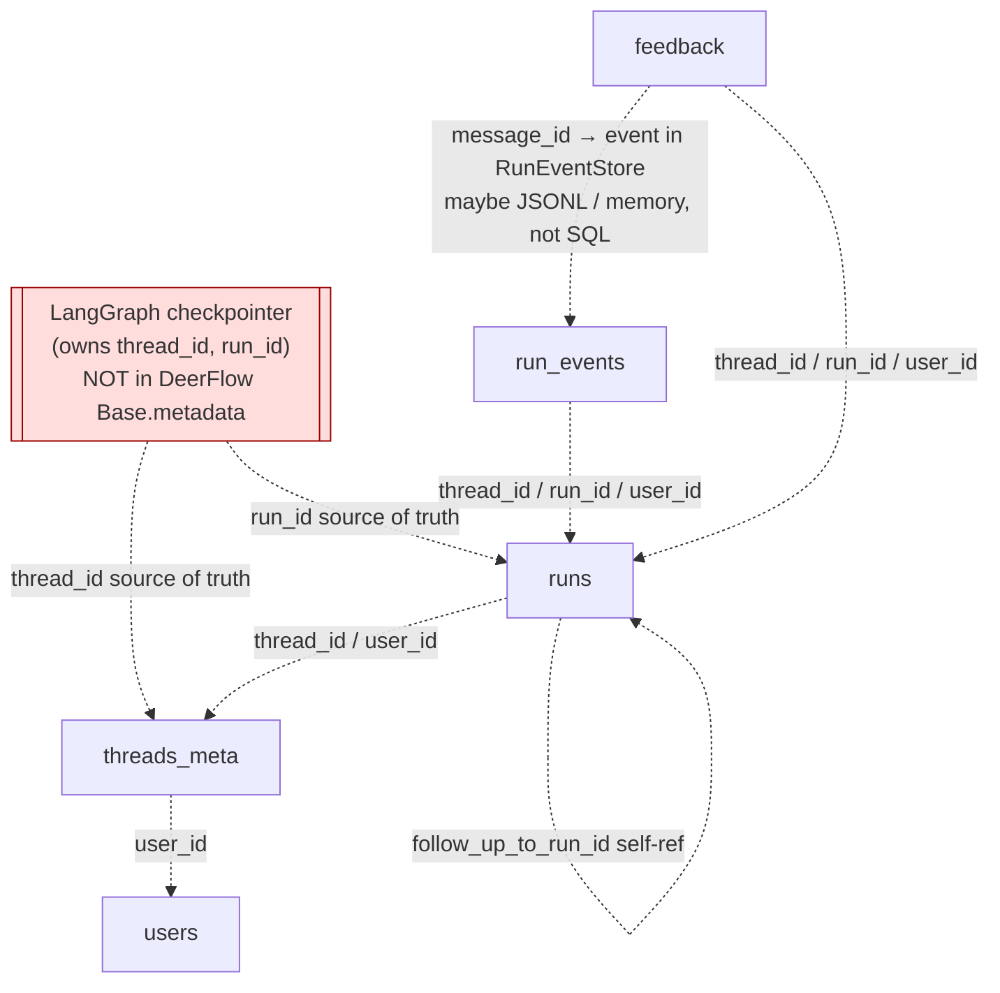
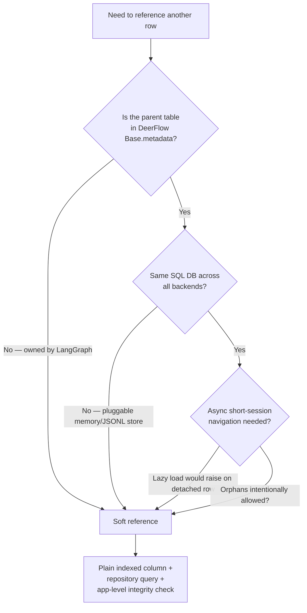

# Soft References & the Repository Pattern

## Purpose

DeerFlow's persistence layer models five tables — `users`, `threads_meta`, `runs`,
`run_events`, `feedback` — that are clearly _related_ (a run belongs to a thread, an
event belongs to a run, feedback targets a run). Yet **not one of these models uses
SQLAlchemy `ForeignKey()` or `relationship()`**. This note explains the deliberate
design choice behind that absence: relationships are expressed as **soft references**
(shared, indexed identifier columns) and navigated through a **repository layer** of
explicit queries, not through the ORM object graph. The invariants a foreign key would
normally guarantee are lifted _up_ into the application boundary.

This is a cross-cutting philosophy that recurs across the whole backend, so it earns a
pattern note rather than living inside a single module write-up.

## Key Files

- `backend/packages/harness/deerflow/persistence/base.py` — declarative `Base`; `to_dict()` iterates **columns only, never relationships**, so it never triggers a lazy load
- `backend/packages/harness/deerflow/persistence/models/run_event.py` — `RunEventRow`; `thread_id`/`run_id`/`user_id` are plain `String` columns
- `backend/packages/harness/deerflow/persistence/thread_meta/model.py` + `sql.py` — sidecar projection of LangGraph's thread; repository navigation via `list_by_thread`
- `backend/packages/harness/deerflow/persistence/run/model.py` + `sql.py` — `follow_up_to_run_id` self-reference (no FK); `aggregate_tokens_by_thread` as a query-expressed relationship
- `backend/packages/harness/deerflow/persistence/feedback/model.py` + `sql.py` — `message_id` points at a `RunEventStore` event in a possibly-different backend
- `backend/app/gateway/routers/feedback.py` — app-level referential integrity (validates run exists & belongs to thread before insert)
- `backend/packages/harness/deerflow/runtime/runs/store/base.py`, `runtime/events/store/base.py` — the abstract `RunStore` / `RunEventStore` interfaces that make storage pluggable

## Important Concepts

- **Soft reference** — a column (`thread_id`, `run_id`, `user_id`, `message_id`,
  `follow_up_to_run_id`) that holds another row's identifier but carries **no SQL
  `ForeignKey` constraint**. It is a join key _by convention_, made fast with a plain
  `index=True` rather than an FK-implied index.

- **Repository pattern** — each entity is fronted by a thin repository
  (`RunRepository`, `ThreadMetaRepository`, `FeedbackRepository`, `DbRunEventStore`)
  whose methods issue explicit `select(...).where(...)` queries. The repository method
  _is_ the relationship traversal — `list_by_thread(thread_id)` replaces what
  `thread.runs` would do via `relationship()`.

- **Identity ownership inversion** — the authority for a _thread_ is **LangGraph's
  checkpointer**, not DeerFlow's ORM. `threads_meta` is a projection keyed by
  LangGraph's externally-issued `thread_id`. There is no `threads` table in DeerFlow's
  `Base.metadata` to point a foreign key at.

- **Invariants at the boundary** — the same philosophy that drops FKs also drops DB
  enums and CHECK constraints: `system_role` is validated by a Pydantic
  `Literal["admin","user"]`, `rating` is checked `in (1, -1)` in Python. The schema
  stays permissive and portable; correctness is enforced one layer up.

## Execution Flow

How a "give me all feedback for this run" request resolves — **without** any ORM
relationship navigation:

Contrast the ORM-native approach this replaces: `thread = session.get(Thread, id);
return thread.runs[i].feedback` — which would require `relationship()` declarations,
a real `threads` table, FK columns, and a lazy load that _raises_ on a detached row in
an async session.

## Architecture Diagrams

### Soft-reference dependency map

Dashed arrows are references that would be foreign keys in a classic schema, but here
are plain indexed identifier columns. The double box is owned by a _different_ system.

### Decision flow: why no FK here?

## My Insights

**The pattern is forced first, then embraced.** The single hardest constraint is
identity ownership: a `thread_id` is minted by LangGraph's checkpointer, which lives in
tables DeerFlow's `create_all()` does not manage (`base.py` says so explicitly). You
_cannot_ declare `runs.thread_id → threads.thread_id` when there is no `threads` table
in your metadata. So the absence of FKs starts as a necessity. But DeerFlow then leans
into it, because three further forces all point the same way:

1. **Pluggable backends.** `RunEventStore` and `RunStore` have memory / SQL / JSONL
   implementations. A foreign key only exists inside one SQL database; `feedback.message_id`
   may reference an event that lives in a JSONL file. FKs would hard-wire a SQL-only
   assumption into models that are meant to be backend-agnostic.

2. **Async session hygiene.** The repositories use short-lived sessions (open → commit →
   detach). `relationship()` lazy loads on a _detached_ async row raise an error, so
   `to_dict()` is deliberately built from `column_attrs` only — it never walks a
   relationship, which is why it's safe on detached rows (and pairs with the engine's
   `expire_on_commit=False`). Declaring relationships would invite exactly the bug they
   engineered around.

3. **Intentional orphans.** Nullable `user_id` (pre-auth/shared rows),
   `follow_up_to_run_id` pointing at a possibly-deleted run, events written by background
   workers around the time the parent row appears — these are all states a strict FK would
   reject. Soft references tolerate them; cleanup is orchestrated in app code, not via
   DB cascade.

And there's a quiet kicker: **on default SQLite, foreign keys aren't even enforced**
unless you set `PRAGMA foreign_keys = ON` per connection. So declaring FKs would have
bought _false confidence_ on the primary backend while constraining the others. Being
explicit that integrity is app-managed is the more honest design.

**How the relationship knowledge is preserved.** Nothing is lost — it's relocated. The
join keys are a naming convention (`thread_id` means the same thing everywhere). The
indexes that an FK would create are declared by hand (`index=True`). The _navigation_ an
FK + `relationship()` would enable is written as repository methods
(`list_by_thread`, `list_by_run`, `aggregate_tokens_by_thread`). The _referential
integrity_ an FK would enforce is done in routers (the feedback endpoint validates the
run exists and belongs to the thread before inserting). The result is that all the
relational semantics live in code you can read top-to-bottom, uniformly across every
storage backend — at the cost of the database no longer being the last line of defense.

**This is one instance of a backend-wide stance.** The same "permissive schema, strict
boundary" choice appears in `system_role` (Pydantic `Literal`, not a DB enum, to avoid
`ALTER TYPE`/`ALTER TABLE` pain and keep SQLite/Postgres identical) and `rating`
(checked `±1` in Python, not a DB CHECK). DeerFlow consistently treats the database as a
**portable, dumb store** and the application as the **smart, authoritative layer**. If
you're writing the Medium piece, this is the throughline: _the schema is deliberately
boring so the architecture can stay flexible._

## Open Questions

- If a future code path writes a soft-reference column via a raw `update()` (bypassing
  the repository + Pydantic boundary), nothing catches a dangling or malformed value.
  The invariant is maintained by convention, not the schema — is there a test that guards
  the single-write-path assumption?
- The `system_role`/`rating`/FK-free choices all assume one write path per table. Does
  any migration script or admin tool write these tables directly, and if so does it
  re-validate?
- Cross-backend: the OAuth partial unique index uses `sqlite_where` only; the soft-ref
  philosophy means Postgres deployments rely even more on app-level integrity. Is
  Postgres a supported prod target, or is SQLite the sole backend in practice?

## Links to Related Sections

- [[18-persistence-layer]] — the section this pattern was extracted from (models + repositories)
- [[06-auth-authorization]] — `system_role` Pydantic `Literal`, `token_version` stateless revocation; the boundary-invariant philosophy
- [[07-langgraph-runtime]] — owns the canonical `thread_id`/`run_id` and the checkpointer tables that DeerFlow's `Base` deliberately does not manage; `RunStore`/`RunEventStore` pluggable backends
- [[02-system-architecture]] — the harness/app import firewall that pushes auth _behaviour_ into `app/` while the `UserRow` _table_ stays in the harness
